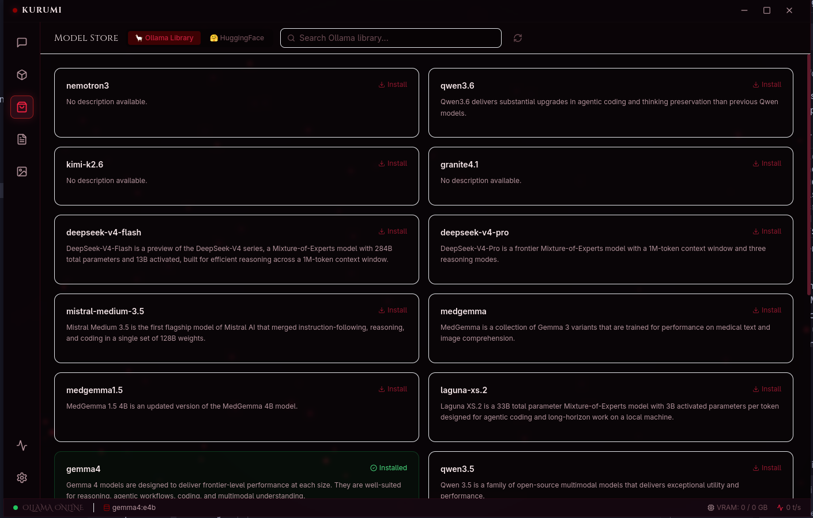

# KURUMI

> **⚠️ IMPORTANT ARCHITECTURE CHANGE:** The `kurumi` command now launches the interactive Terminal UI (TUI). To launch the traditional Electron GUI, run `kurumi run` instead.

<div align="center">

```
██╗  ██╗██╗   ██╗██████╗ ██╗   ██╗███╗   ███╗██╗
██║ ██╔╝██║   ██║██╔══██╗██║   ██║████╗ ████║██║
█████╔╝ ██║   ██║██████╔╝██║   ██║██╔████╔██║██║
██╔═██╗ ██║   ██║██╔══██╗██║   ██║██║╚██╔╝██║██║
██║  ██╗╚██████╔╝██║  ██║╚██████╔╝██║ ╚═╝ ██║██║
╚═╝  ╚═╝ ╚═════╝ ╚═╝  ╚═╝ ╚═════╝ ╚═╝     ╚═╝╚═╝
```

### **Kinetic Unified Runtime for Universal Model Interaction**

*The last local AI desktop client you'll ever need.*

<br/>

[](https://github.com/bhoomik-codes/kurumi)
[](https://github.com/bhoomik-codes/kurumi/releases)
[](https://electronjs.org)
[](https://react.dev)
[](https://typescriptlang.org)
[](LICENSE)

<br/>

> *「 Your data. Your models. Your domain. 」*

<br/>

</div>

---

## 📸 Screenshots

<div align="center">

### 💬 Chat — Markdown Rendering with Conversation Sidebar


<br/>

### 🧠 Local Models Manager


<br/>

### 🛍️ Model Store — Live Ollama Library Browser



<br/>

### 🩸 New Chat Empty State


</div>

---

## 🩸 What is KURUMI?

**KURUMI** is a fully offline, privacy-first desktop application that brings the full power of large language models to your local machine — zero subscriptions, zero data leaks, zero cloud dependency. Run frontier-class AI on your own hardware. Own your data completely.

Inspired by the visual brutality of **Jujutsu Kaisen**, KURUMI's "Cursed Blood" interface bleeds deep crimson through neo-glassmorphism panels, glowing vein-like borders, and particle energy effects. It doesn't just run AI — it *channels* it.

---

## ✦ Current Features

### 💬 Chat Interface

- **Real-time streaming** — tokens appear as they generate, with an animated "Summoning from the void..." loading state
- **Conversation sidebar** — full chat history with search, pin/unpin, and delete
- **Markdown rendering** — rich formatted output with syntax-highlighted code blocks (Cursed Blood dark theme), tables, lists, blockquotes, and more
- **Copy button** on every code block — one click to clipboard
- **System prompt** — every conversation is pre-seeded with formatting instructions so the model uses Markdown automatically
- **Auto-scroll** — chat window follows the stream in real time
- **Multi-turn memory** — full conversation history sent to the model on every message

### ⚡ Interactive Artifacts Engine

- **Sandboxed Execution** — When models write code, KURUMI safely runs it.
- **React Components** — Live preview and interact with generated React UIs.
- **HTML/CSS Sandboxes** — Renders vanilla web code in an isolated iframe.
- **Charts & Graphs** — Instantly draws `recharts` and `d3` components, deeply integrated with the app's dark theme.
- **Mermaid Diagrams** — Fully zoomable interactive Flowcharts, Sequence Diagrams, and ER Models.
- **Math / KaTeX** — Precise, beautiful rendering for complex mathematical equations.

### 🖼️ Image Generation Studio

- **Automatic1111** — txt2img and img2img with sampler / steps / CFG / size / seed, optional checkpoint override, denoise control for img2img
- **Save to disk** — one-click export of the current preview into the app data directory as PNG
- **ComfyUI** — quick connection test to a local Comfy server (full workflow queue is not wired in this build)

### 🎙️ Cursed Speech (Voice & TTS)

- **Local Speech-to-Text (STT)** — Push-to-talk microphone powered by **Whisper ONNX** running in a dedicated background worker process.
- **Cursed Waveform** — Real-time crimson waveform visualizer reflecting your voice intensity.
- **Auto-Read TTS** — Responses read aloud using the OS-native `SpeechSynthesis` API.
- **Personas** — Choose your TTS persona (Cursed, Whisper, Domain) directly from the settings.

### 🧠 Model Management & Cloud Fallback

- **Installed models page** — see all local Ollama models with size, parameters, quantization level, and family
- **Cloud Models via NVIDIA NIM** — Seamlessly fallback to lightning-fast cloud endpoints (like Llama 3.1 405B) when local compute isn't enough, instantly switchable in chat.
- **🔬 AirLLM — Frontier Models on Consumer GPUs** — Run 30B, 40B, 70B, even 405B parameter models on a single GPU with as little as 4 GB VRAM using layer-by-layer weight streaming. No quantization, no cloud. Switch to AirLLM provider directly from the chat header.
- **Image checkpoints (A1111)** — separate panel to list Stable Diffusion checkpoints from your WebUI API and mark which one Image Gen should use
- **One-click select** — switch active model from the Models page
- **Pull new models** — download directly from inside the app with a real-time streaming progress bar (%)
- **Delete models** — with double-confirm safety guard

### 🛍️ Model Store

- **Dual-source browser** — browse live from **Ollama Library** and **HuggingFace Hub** simultaneously
- **Catalog scope** — filter search results toward **language / chat models** vs **image & diffusion** (plus *All*) on both tabs
- **HuggingFace GGUF search** — sorted by Most Downloaded / Liked / Newest
- **Quantization picker** — see all available `.gguf` variants per HuggingFace model with file sizes
- **Direct install** — `ollama pull hf.co/org/repo:Q4_K_M` wired directly to streaming progress modal
- **Pagination** — navigate pages of results
- **Installed detection** — already-installed models show a green "Installed" badge across both sources

### 🎨 Aesthetics ("Cursed Blood" Theme)

- **Deep void background** `#050305` with floating red particle emitters
- **Glassmorphism panels** — `backdrop-filter: blur(16px)` layered glass throughout
- **Red accent system** — `#8B0000` → `#C41E3A` → `#FF2244` gradient hierarchy
- **Glowing borders** — red vein-like borders with radial `box-shadow` on active elements
- **Animated loading states** — pulsing orb, streaming cursor, gradient progress bars
- **Frameless window** — custom title bar with minimize/maximize/close controls

### 🗄️ Data Persistence & Multi-Process Architecture

- **SQLite database** — all conversations and messages stored locally via `better-sqlite3`
- **Full-text search** — FTS5 index on message content
- **Conversation hydration** — last conversation automatically restored on app restart
- **LanceDB vector store (RAG)** — document embeddings and chunk text persist under the app data directory at `vectorstore/`. Similarity search uses cosine distance with `topK` / `minScore` pushed into LanceDB (`distanceRange` + indexed-document filters). Chunk metadata (`document_id`, `filename`, `page_index` as chunk order) is stored as JSON in the `metadata` column for Sources in chat.
- **Utility Process Worker** — Heavy document parsing, vector generation (`nomic-embed-text`), and Whisper STT inference are fully offloaded to an isolated Electron Utility Process. This ensures the main UI thread never freezes.
- **Native modules** — `@lancedb/lancedb` ships platform binaries; `npm install` runs `electron-builder install-app-deps` so bindings match Electron. ASAR unpack configurations ensure stable `.exe` / `.app` bundled builds. If you change Electron versions or hit ABI errors on Linux (e.g. Fedora), run `npm run postinstall` or `npx electron-rebuild -f -w @lancedb/lancedb`.

---

## ✦ Planned Features (Roadmap)

```
✅ Phase 1 — Project scaffold, Electron + Vite + Tailwind
✅ Phase 2 — Ollama IPC bridge, streaming chat, SQLite persistence
✅ Phase 3 — Chat UI polish, loading states, DB hydration on reload
✅ Phase 4 — Models page + Model Store (Ollama + HuggingFace live)
✅ Phase 5 — Conversation Sidebar with history, search, pin/delete
✅ Phase 5b — Markdown renderer + syntax highlighting + system prompt
✅ Phase 6 — Document Upload & RAG (PDF, DOCX, local vector search)
✅ Phase 7 — Artifact rendering (React live preview, Mermaid, LaTeX)
✅ Phase 8 — Image Generation Studio (Automatic1111 core + ComfyUI probe)
✅ Phase 9 — Cursed Speech (Voice & TTS via Whisper ONNX + Web Speech API)
✅ Phase 10 — Cloud LLM Integration (NVIDIA NIM fallback)
⬜ Phase 11 — Prompt Library, Personas, Model Comparison
⬜ Phase 12 — Packaged releases (Win / macOS / Linux)
```

**On the horizon:**

- 🤖 Agent mode with local tool use (web search, file system)
- 🔌 Plugin system for community extensions
- 🗺️ Canvas mode — infinite whiteboard with AI chat nodes
- 📺 Screen OCR — capture any region and send to the model
- 🔄 Workflow builder — chain prompts like a local n8n for AI

---

## ✦ Tech Stack

| Layer | Technology | Version |
|---|---|---|
| Desktop Shell | [Electron](https://electronjs.org) | 30 |
| Frontend | [React](https://react.dev) + TypeScript | 18 / 5 |
| Build Tool | [Vite](https://vitejs.dev) + vite-plugin-electron | 5 |
| Styling | [Tailwind CSS](https://tailwindcss.com) + Custom CSS | 3 |
| State Management | [Zustand](https://zustand-demo.pmnd.rs) | 4 |
| Routing | React Router DOM | 6 |
| LLM Runtime | [Ollama](https://ollama.com) | Latest |
| Voice STT | Whisper ONNX (`@xenova/transformers`) | v2 |
| Voice TTS | Native Web Speech API (`SpeechSynthesis`) | OS Native |
| Database | [better-sqlite3](https://github.com/WiseLibs/better-sqlite3) + FTS5 | 9 |
| RAG / vectors | [LanceDB](https://lancedb.github.io/lancedb/) (`@lancedb/lancedb`, embedded) | 0.27 |
| Artifact Runtime | `@babel/standalone` (in sandboxed iframe) | Latest |
| Markdown | react-markdown + remark-gfm | Latest |
| Syntax Highlighting | react-syntax-highlighter (Prism) | Latest |
| Notifications | [Sonner](https://sonner.emilkowal.ski) | Latest |
| Testing | [Vitest](https://vitest.dev) | 2.x |
| Icons | [Lucide React](https://lucide.dev) | Latest |
| IDs | uuid v4 | 9 |

> **100% offline capable.** Zero telemetry. Zero cloud calls (except model browsing & optional NVIDIA NIM). Your models, your data, your machine.

---

## ✦ Architecture

KURUMI v2.0 introduces a **Daemon-Client Architecture** to ensure rock-solid reliability and performance:

1. **Proxy Daemon (`kurumid`)**: A lightweight background Fastify server that owns all database connections and AI models. 
2. **Thin Clients**: The Electron GUI, the TUI, and the CLI are all thin clients that talk to the daemon over a local HTTP API.

**Why this change?**
- **Reliability (Single Writer)**: Previously, the Electron GUI and CLI both tried to write to SQLite simultaneously, causing locking errors. Now, the daemon is the sole writer.
- **Speed & Memory (Resident Models)**: Large language models take a long time to load into VRAM. By hosting the models in a persistent background daemon, the models stay "warm" between requests. Cold requests take ~15.7s, but warm requests take ~1.0s.
- **Crash Isolation**: The daemon includes a Supervisor that monitors heavy AI processes like AirLLM. If they crash due to an OOM error, the supervisor restores service after an unexpected exit without bringing down the UI.

## ✦ Prerequisites

Before running KURUMI, ensure you have:

| Requirement | Notes |
|---|---|
| [Node.js](https://nodejs.org) (v20+) | Required for compiling and running from source |
| Python 3 & pip | Required for AirLLM frontier models |
| [Ollama](https://ollama.com) | The primary backend for local inference |

---

## 🌱 Complete Setup Guide

### Step 1: Download KURUMI
```bash
git clone https://github.com/bhoomik-codes/kurumi.git
cd kurumi
npm install
```

### Step 2: Configure Environment
Copy the example environment file:
```bash
cp .env.example .env
```
Edit `.env` if you need to change ports, log levels, or add your NVIDIA API key for cloud fallback. Defaults are provided for all local services.

### Step 3: Run Setup & Doctor
Install all necessary Python dependencies and verify the environment:
```bash
npm run build:cli
./dist/kurumi-cli setup
./dist/kurumi-cli doctor
```
*(The doctor command will verify your GPU, Daemon, Ollama, and SQLite health before you start).*

### Step 4: Run KURUMI

| Command | Description |
|---|---|
| `./dist/kurumi-cli` | Launch the interactive Terminal UI (TUI) |
| `./dist/kurumi-cli --ask "..."` | Ask a quick one-shot question from the terminal |
| `./dist/kurumi-cli run` | Launch the Electron GUI |
| `./dist/kurumi-cli setup` | Install all dependencies |
| `./dist/kurumi-cli server` | Start the background daemon only |
| `./dist/kurumi-cli doctor` | Run environment health checks |
| `./dist/kurumi-cli help` | Show full help |

> **Breaking Change:** Running `kurumi` (or the CLI binary) now opens the TUI by default. Use `kurumi run` to open the Electron GUI.

---

## ✦ Building for Production

```bash
# Build for your current platform
npm run build

# Platform-specific builds
npm run build:win    # Windows (.exe installer)
npm run build:mac    # macOS (.dmg)
npm run build:linux  # Linux (.AppImage + .snap)
```

Built artifacts are output to `dist/`.

---

## ✦ Changelog

### `v1.0.0` — The Domain Expansion *(Latest)*

- ✅ **Phase 9 — Cursed Speech (Voice & TTS):** Added fully local Whisper ONNX STT in the utility process and Web Speech API TTS for auto-reading responses.
- ✅ **Interactive Artifacts Engine:** Sandboxed iframe execution for React, Recharts, Mermaid, and KaTeX right inside the chat window.
- ✅ **NVIDIA NIM Cloud Fallback:** Seamless dual-provider switching to flip between local Ollama models and lightning-fast cloud endpoints.
- ✅ **Multi-Process Architecture:** Extract heavy LanceDB embedding generation and Whisper transcription out of the main thread and into an Electron Utility Process.
- ✅ **Stable Bundles:** Fixed `electron-builder` native ASAR unpack paths to ensure standalone `.exe` installers work perfectly on Windows without runtime binary errors.

### `v0.6.1` — Phase 6 finalized: RAG hardening

- ✅ **RAG IPC integrity:** added canonical `rag:index` / `rag:search` channels (while keeping `docs:*` compatibility)
- ✅ **Service split:** parsing, embedding, and vector retrieval extracted into dedicated services (`ParseService`, `EmbeddingService`, `VectorStore`)
- ✅ **Quality controls:** tuned Top-K + minimum score filtering and source diversity to reduce noisy chunk injection
- ✅ **Supported parsing verified:** PDF / DOCX / XLSX extraction pipeline and improved chunking defaults (~512-token chunks with overlap)
- ✅ **Knowledge Base UI:** finalized panelized document manager with statuses and delete actions
- ✅ **Grounded answers:** assistant output now appends a visible **Sources** section when RAG context is used
- ✅ **Runtime stability:** indexing yields frequently to keep Electron responsive on large files and unloads embedding model after indexing

### `v0.6.0` — Image Generation Studio & model discovery

- ✅ **Phase 8 (core):** Automatic1111 txt2img + img2img over local REST (`imagegen:*` IPC), PNG save to app `userData/generated-images`, checkpoint override via `override_settings`
- ✅ **ComfyUI:** reachability probe (`/system_stats` / `/queue`); queue workflows not bundled in this release
- ✅ **Models page:** dedicated **Image generation checkpoints** panel — load SD checkpoints from WebUI, pick active checkpoint for the studio (syncs with Image Gen)
- ✅ **Model Store:** **Search scope** control — *All* / *Language · chat* / *Image · diffusion* (HuggingFace GGUF uses `pipeline_tag` / hub filters; Ollama library uses name heuristics)
- ✅ **Image Gen UI:** generation mode toggle, denoising slider for img2img, optional checkpoint dropdown after connect
- ✅ **Stability & feedback:** centralized IPC error logging with stack traces in dev, Sonner toasts for probe/generation/save failures, tunable A1111 timeouts via `KURUMI_A1111_TIMEOUT_MS` / `KURUMI_A1111_PROBE_MS`, and initial Vitest + CI coverage for imagegen payload helpers.

### `v0.5.0` — Markdown & System Prompt

- ✅ Full Markdown renderer with Cursed Blood syntax highlighting
- ✅ Copy button on all code blocks
- ✅ System prompt injected on every request (Kurumi persona + formatting rules)
- ✅ User messages rendered as plain text, assistant as rich Markdown

### `v0.4.0` — Conversation Sidebar

- ✅ Persistent conversation history panel
- ✅ Per-conversation search, pin/unpin, delete
- ✅ DB hydration on app restart (last conversation auto-loaded)
- ✅ "New Chat" button with instant state reset

### `v0.3.1` — Live Model Store

- ✅ HuggingFace Hub GGUF browser (sorted by downloads/likes/newest)
- ✅ Ollama Library live scrape
- ✅ Quantization picker modal per HF model
- ✅ Direct `hf.co/` pull with streaming progress bar

### `v0.3.0` — Model Management Page

- ✅ Installed model cards with size, params, quantization details
- ✅ Model select, pull (with real-time % progress bar), and delete
- ✅ Curated offline model registry as fallback

### `v0.2.0` — Core Chat + IPC

- ✅ Ollama streaming chat via `ipcMain.on` + `event.sender.send`
- ✅ Loading indicator ("Summoning from the void...")
- ✅ SQLite schema with FTS5 for conversations and messages
- ✅ Streaming abort button

### `v0.1.0` — Foundation

- ✅ Electron + Vite + React + TypeScript scaffold
- ✅ Tailwind CSS + Cursed Blood design system
- ✅ Glassmorphism layout — TopBar, Sidebar, StatusBar, ParticleBackground
- ✅ Frameless window with custom controls
- ✅ Secure IPC bridge via `contextBridge`

---

## ✦ Why KURUMI?

| The Old Way | The KURUMI Way |
|---|---|
| Pay monthly for API access | Run everything on your hardware |
| Your prompts train someone else's model | Nothing leaves your machine |
| One model, take it or leave it | Switch between 50+ models in one click |
| Basic chat UI | Rich Markdown, syntax highlighting, live artifacts |
| Upload files to third-party servers | Parse locally, embed locally, query locally |
| Generic grey interface | A UI you actually want to look at |
| Closed source, black box | MIT licensed, fully auditable |

---

## ✦ Developer notes

- **Environment flags**: `KURUMI_A1111_TIMEOUT_MS` (txt2img/img2img timeout ceiling in ms), `KURUMI_A1111_PROBE_MS` (probe timeout ceiling in ms), `KURUMI_DEBUG_WORKER=1` (mirror RAG worker stdout to main logs).
- **Tests**: `npm test` runs Vitest over Electron-side pure helpers (`electron/services/imageGenPayload.test.ts`). Use `npm run test:watch` for interactive mode. CI also runs `tsc` for type-checking the renderer and Electron main.
- **IPC logging**: all `imagegen:*` handlers use a shared `ipcLogger` for structured error events with messages and stack traces in development.
- **Native rebuild**: after changing Electron versions or on a fresh Linux box, run `npm run rebuild:natives` to rebuild `@lancedb/lancedb` and `better-sqlite3` against the correct ABI.

## ✦ Contributing

KURUMI is being built in public. Contributions, issues, and ideas are welcome.

1. Fork the repository
2. Create a feature branch: `git checkout -b feat/your-feature`
3. Commit with conventional commits: `git commit -m "feat: add voice input"`
4. Push and open a Pull Request

Please follow the existing code style (TypeScript strict, functional React components, Tailwind utility classes).

---

## ✦ Credits

Special thanks to [lyogavin](https://github.com/lyogavin) for creating [AirLLM](https://github.com/lyogavin/airllm), which powers the frontier-model streaming engine in KURUMI.

---

## ✦ License

MIT — take it, fork it, make it yours.

See [LICENSE](LICENSE) for full text.

---

<div align="center">

<br/>

```
「 Unlimited Void. Unlimited Intelligence. 」
```

<br/>

*Built with obsession. Themed with intention. Powered by open source.*

<br/>

[](https://github.com/bhoomik-codes/kurumi)

</div>
