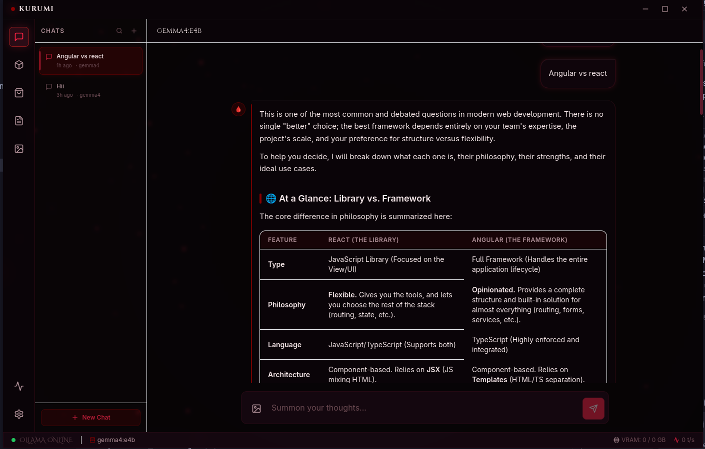
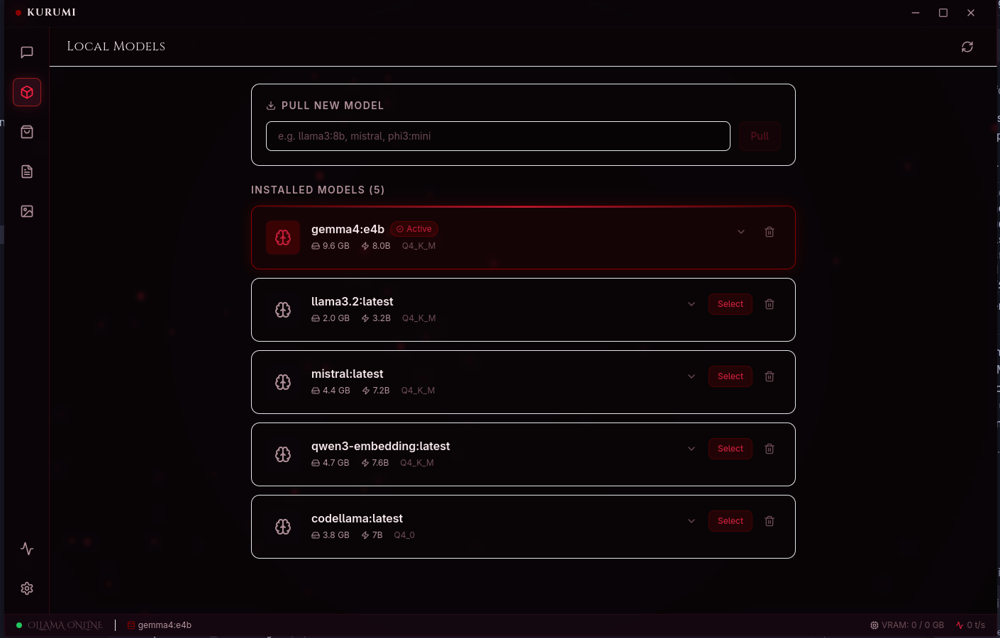
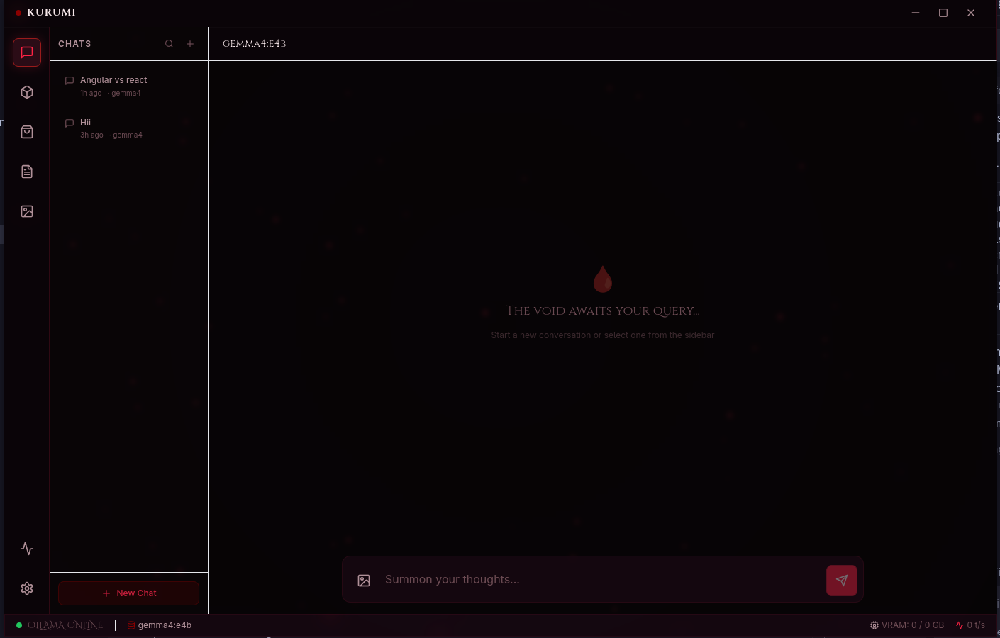

<div align="center">

```
██╗  ██╗██╗   ██╗██████╗ ██╗   ██╗███╗   ███╗██╗
██║ ██╔╝██║   ██║██╔══██╗██║   ██║████╗ ████║██║
█████╔╝ ██║   ██║██████╔╝██║   ██║██╔████╔██║██║
██╔═██╗ ██║   ██║██╔══██╗██║   ██║██║╚██╔╝██║██║
██║  ██╗╚██████╔╝██║  ██║╚██████╔╝██║ ╚═╝ ██║██║
╚═╝  ╚═╝ ╚═════╝ ╚═╝  ╚═╝ ╚═════╝ ╚═╝     ╚═╝╚═╝
```

### **Kinetic Unified Runtime for Universal Model Interaction**

*The last local AI desktop client you'll ever need.*

<br/>

[](https://github.com/bhoomik-codes/kurumi)
[](https://github.com/bhoomik-codes/kurumi/releases)
[](https://electronjs.org)
[](https://react.dev)
[](https://typescriptlang.org)
[](LICENSE)

<br/>

> *「 Your data. Your models. Your domain. 」*

<br/>

</div>

---

## 📸 Screenshots

<div align="center">

### 💬 Chat — Markdown Rendering with Conversation Sidebar


<br/>

### 🧠 Local Models Manager


<br/>

### 🛍️ Model Store — Live Ollama Library Browser


<br/>

### 🩸 New Chat Empty State


</div>

---

## 🩸 What is KURUMI?

**KURUMI** is a fully offline, privacy-first desktop application that brings the full power of large language models to your local machine — zero subscriptions, zero data leaks, zero cloud dependency. Run frontier-class AI on your own hardware. Own your data completely.

Inspired by the visual brutality of **Jujutsu Kaisen**, KURUMI's "Cursed Blood" interface bleeds deep crimson through neo-glassmorphism panels, glowing vein-like borders, and particle energy effects. It doesn't just run AI — it *channels* it.

---

## ✦ Current Features

### 💬 Chat Interface
- **Real-time streaming** — tokens appear as they generate, with an animated "Summoning from the void..." loading state
- **Conversation sidebar** — full chat history with search, pin/unpin, and delete
- **Markdown rendering** — rich formatted output with syntax-highlighted code blocks (Cursed Blood dark theme), tables, lists, blockquotes, and more
- **Copy button** on every code block — one click to clipboard
- **System prompt** — every conversation is pre-seeded with formatting instructions so the model uses Markdown automatically
- **Auto-scroll** — chat window follows the stream in real time
- **Multi-turn memory** — full conversation history sent to the model on every message

### 🧠 Model Management
- **Installed models page** — see all local Ollama models with size, parameters, quantization level, and family
- **One-click select** — switch active model from the Models page
- **Pull new models** — download directly from inside the app with a real-time streaming progress bar (%)
- **Delete models** — with double-confirm safety guard

### 🛍️ Model Store
- **Dual-source browser** — browse live from **Ollama Library** and **HuggingFace Hub** simultaneously
- **HuggingFace GGUF search** — sorted by Most Downloaded / Liked / Newest
- **Quantization picker** — see all available `.gguf` variants per HuggingFace model with file sizes
- **Direct install** — `ollama pull hf.co/org/repo:Q4_K_M` wired directly to streaming progress modal
- **Pagination** — navigate pages of results
- **Installed detection** — already-installed models show a green "Installed" badge across both sources

### 🎨 Aesthetics ("Cursed Blood" Theme)
- **Deep void background** `#050305` with floating red particle emitters
- **Glassmorphism panels** — `backdrop-filter: blur(16px)` layered glass throughout
- **Red accent system** — `#8B0000` → `#C41E3A` → `#FF2244` gradient hierarchy
- **Glowing borders** — red vein-like borders with radial `box-shadow` on active elements
- **Animated loading states** — pulsing orb, streaming cursor, gradient progress bars
- **Frameless window** — custom title bar with minimize/maximize/close controls

### 🗄️ Data Persistence
- **SQLite database** — all conversations and messages stored locally via `better-sqlite3`
- **Full-text search** — FTS5 index on message content
- **Conversation hydration** — last conversation automatically restored on app restart

---

## ✦ Planned Features (Roadmap)

```
✅ Phase 1 — Project scaffold, Electron + Vite + Tailwind
✅ Phase 2 — Ollama IPC bridge, streaming chat, SQLite persistence
✅ Phase 3 — Chat UI polish, loading states, DB hydration on reload
✅ Phase 4 — Models page + Model Store (Ollama + HuggingFace live)
✅ Phase 5 — Conversation Sidebar with history, search, pin/delete
✅ Phase 5b — Markdown renderer + syntax highlighting + system prompt
🔄 Phase 6 — Document Upload & RAG (PDF, DOCX, local vector search)
⬜ Phase 7 — Artifact rendering (React live preview, Mermaid, LaTeX)
⬜ Phase 8 — Image Generation Studio (Automatic1111 / ComfyUI)
⬜ Phase 9 — Voice input (Web Speech API + Whisper.cpp)
⬜ Phase 10 — Prompt Library, Personas, Model Comparison
⬜ Phase 11 — Packaged releases (Win / macOS / Linux)
```

**On the horizon:**
- 🤖 Agent mode with local tool use (web search, file system)
- 🔌 Plugin system for community extensions
- 🗺️ Canvas mode — infinite whiteboard with AI chat nodes
- 🔊 Local TTS for spoken responses (Piper / Kokoro)
- 📺 Screen OCR — capture any region and send to the model
- 🔄 Workflow builder — chain prompts like a local n8n for AI

---

## ✦ Tech Stack

| Layer | Technology | Version |
|---|---|---|
| Desktop Shell | [Electron](https://electronjs.org) | 30 |
| Frontend | [React](https://react.dev) + TypeScript | 18 / 5 |
| Build Tool | [Vite](https://vitejs.dev) + vite-plugin-electron | 5 |
| Styling | [Tailwind CSS](https://tailwindcss.com) + Custom CSS | 3 |
| State Management | [Zustand](https://zustand-demo.pmnd.rs) | 4 |
| Routing | React Router DOM | 6 |
| Markdown | react-markdown + remark-gfm | Latest |
| Syntax Highlighting | react-syntax-highlighter (Prism) | Latest |
| LLM Runtime | [Ollama](https://ollama.com) | Latest |
| Database | [better-sqlite3](https://github.com/WiseLibs/better-sqlite3) + FTS5 | 9 |
| Icons | [Lucide React](https://lucide.dev) | Latest |
| IDs | uuid v4 | 9 |

> **100% offline capable.** Zero telemetry. Zero cloud calls (except model browsing). Your models, your data, your machine.

---

## ✦ Architecture

```
local-guide/
└── kurumi/                    ← Electron application root
    ├── electron/              ← Main process (Node.js)
    │   ├── main.ts            ← App lifecycle, window, CSP
    │   ├── preload.ts         ← Secure contextBridge IPC bridge
    │   ├── ipc/
    │   │   ├── ollama.ipc.ts  ← Chat streaming, model list, pull, delete
    │   │   ├── sqlite.ipc.ts  ← Conversation & message CRUD
    │   │   └── store.ipc.ts   ← Ollama library + HuggingFace API proxy
    │   └── services/
    │       ├── OllamaService.ts    ← fetch-based streaming client
    │       └── DatabaseService.ts  ← SQLite init, schema, FTS5
    ├── src/                   ← Renderer process (React)
    │   ├── pages/
    │   │   ├── Chat.tsx           ← Main chat interface
    │   │   ├── Models.tsx         ← Installed model manager
    │   │   ├── ModelStore.tsx     ← Live Ollama + HuggingFace browser
    │   │   ├── Documents.tsx      ← (Phase 6)
    │   │   ├── ImageGen.tsx       ← (Phase 8)
    │   │   ├── Settings.tsx       ← App configuration
    │   │   └── SystemInfo.tsx     ← Hardware & Ollama status
    │   ├── components/
    │   │   ├── chat/
    │   │   │   ├── MessageBubble.tsx      ← User/assistant message
    │   │   │   ├── MarkdownRenderer.tsx   ← Full MD + syntax highlight
    │   │   │   ├── ChatInput.tsx          ← Input with abort button
    │   │   │   └── ConversationSidebar.tsx ← Chat history panel
    │   │   ├── layout/
    │   │   │   ├── TopBar.tsx             ← Frameless window controls
    │   │   │   ├── Sidebar.tsx            ← App navigation
    │   │   │   ├── StatusBar.tsx          ← Ollama status + model
    │   │   │   └── ParticleBackground.tsx ← Canvas particle system
    │   │   └── ui/
    │   │       ├── GlassPanel.tsx
    │   │       ├── CursedButton.tsx
    │   │       └── CursedInput.tsx
    │   ├── stores/
    │   │   ├── chatStore.ts       ← Conversations, messages, stream state
    │   │   ├── modelStore.ts      ← Available models, active model
    │   │   └── settingsStore.ts   ← App preferences
    │   ├── constants/
    │   │   └── systemPrompt.ts    ← Kurumi's Markdown formatting prompt
    │   └── data/
    │       └── modelRegistry.ts   ← Curated model catalogue (fallback)
    └── assets/
        └── screenshots/           ← README screenshots
```

---

## ✦ Prerequisites

Before running KURUMI, ensure you have:

| Requirement | Version | Notes |
|---|---|---|
| [Node.js](https://nodejs.org) | 20+ | LTS recommended |
| [Ollama](https://ollama.com) | Latest | Must be running (`ollama serve`) |
| At least one LLM | Any | `ollama pull llama3.2:3b` |
| Git | Any | For cloning |
| RAM | 4 GB minimum | 8 GB+ recommended for 7B+ models |

---

## ✦ Getting Started

### 1. Clone the repository

```bash
git clone https://github.com/bhoomik-codes/kurumi.git
cd kurumi/kurumi
```

### 2. Install dependencies

```bash
npm install
```

### 3. Start Ollama

```bash
# Start Ollama in the background (if not already running)
ollama serve

# Pull a model to get started (choose one)
ollama pull llama3.2:3b      # Recommended starter — fast, 2 GB
ollama pull qwen2.5:7b       # Better reasoning, 4.4 GB
ollama pull deepseek-r1:7b   # Best reasoning, 4.7 GB
```

### 4. Launch in development mode

```bash
npm run dev
```

The Electron window will open automatically.

---

## ✦ Building for Production

```bash
# Build for your current platform
npm run build

# Platform-specific builds
npm run build:win    # Windows (.exe installer)
npm run build:mac    # macOS (.dmg)
npm run build:linux  # Linux (.AppImage + .snap)
```

Built artifacts are output to `dist/`.

---

## ✦ Changelog

### `v0.5.0` — Markdown & System Prompt *(Latest)*
- ✅ Full Markdown renderer with Cursed Blood syntax highlighting
- ✅ Copy button on all code blocks
- ✅ System prompt injected on every request (Kurumi persona + formatting rules)
- ✅ User messages rendered as plain text, assistant as rich Markdown

### `v0.4.0` — Conversation Sidebar
- ✅ Persistent conversation history panel
- ✅ Per-conversation search, pin/unpin, delete
- ✅ DB hydration on app restart (last conversation auto-loaded)
- ✅ "New Chat" button with instant state reset

### `v0.3.1` — Live Model Store
- ✅ HuggingFace Hub GGUF browser (sorted by downloads/likes/newest)
- ✅ Ollama Library live scrape
- ✅ Quantization picker modal per HF model
- ✅ Direct `hf.co/` pull with streaming progress bar

### `v0.3.0` — Model Management Page
- ✅ Installed model cards with size, params, quantization details
- ✅ Model select, pull (with real-time % progress bar), and delete
- ✅ Curated offline model registry as fallback

### `v0.2.0` — Core Chat + IPC
- ✅ Ollama streaming chat via `ipcMain.on` + `event.sender.send`
- ✅ Loading indicator ("Summoning from the void...")
- ✅ SQLite schema with FTS5 for conversations and messages
- ✅ Streaming abort button

### `v0.1.0` — Foundation
- ✅ Electron + Vite + React + TypeScript scaffold
- ✅ Tailwind CSS + Cursed Blood design system
- ✅ Glassmorphism layout — TopBar, Sidebar, StatusBar, ParticleBackground
- ✅ Frameless window with custom controls
- ✅ Secure IPC bridge via `contextBridge`

---

## ✦ Why KURUMI?

| The Old Way | The KURUMI Way |
|---|---|
| Pay monthly for API access | Run everything on your hardware |
| Your prompts train someone else's model | Nothing leaves your machine |
| One model, take it or leave it | Switch between 50+ models in one click |
| Basic chat UI | Rich Markdown, syntax highlighting, live artifacts (soon) |
| Upload files to third-party servers | Parse locally, embed locally, query locally (Phase 6) |
| Generic grey interface | A UI you actually want to look at |
| Closed source, black box | MIT licensed, fully auditable |

---

## ✦ Contributing

KURUMI is being built in public. Contributions, issues, and ideas are welcome.

1. Fork the repository
2. Create a feature branch: `git checkout -b feat/your-feature`
3. Commit with conventional commits: `git commit -m "feat: add voice input"`
4. Push and open a Pull Request

Please follow the existing code style (TypeScript strict, functional React components, Tailwind utility classes).

---

## ✦ License

MIT — take it, fork it, make it yours.

See [LICENSE](LICENSE) for full text.

---

<div align="center">

<br/>

```
「 Unlimited Void. Unlimited Intelligence. 」
```

<br/>

*Built with obsession. Themed with intention. Powered by open source.*

<br/>

[](https://github.com/bhoomik-codes/kurumi)

</div>
